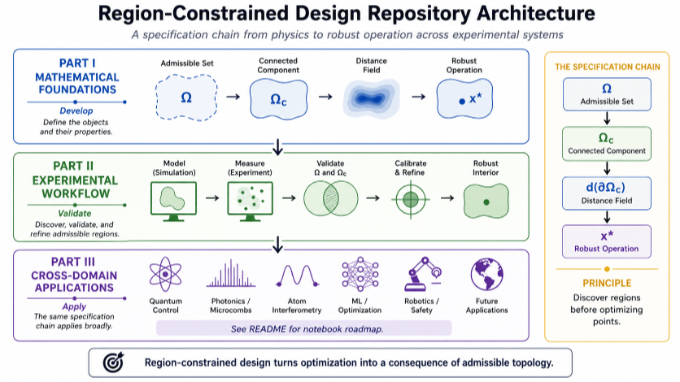

# Integrated Quantum Photonics

Computational notebooks exploring integrated quantum photonics, microresonators, frequency combs, squeezing, scalable continuous-variable quantum computing, and region-constrained experimental design.

This repository develops a common specification chain that begins with device physics and ends with experimentally robust operating points. Although motivated by integrated photonics, the mathematical structure generalizes across quantum hardware, photonics, atom interferometry, machine learning, and robotics.

<p align="center">

</p>

---

## Repository architecture

The notebooks are organized into three connected parts.

### Part I — Physics and Mathematical Foundations

Develop the mathematical objects describing admissible experimental behavior.

```text
physics
→ constraints
→ Ω
→ Ωc
→ d(∂Ωc)
→ x*
```

Topics include

* frequency multiplexing
* Kerr nonlinear interactions
* squeezing
* many-mode entanglement
* integrated photonic circuits
* admissible regions
* connected admissible regions
* robustness margins

---

### Part II — Experimental Specification

Turn theoretical regions into experimentally meaningful design objects.

```text
simulation
→ experiment
→ validation
→ refinement
→ robust operation
```

These notebooks introduce

* admissible-region discovery
* connected-region validation
* calibration
* robustness margins
* distance-to-boundary analysis
* experimental workflow

---

### Part III — Cross-Domain Applications

Apply the same specification chain to multiple experimental sciences.

Examples include

* quantum control
* integrated photonics
* microcombs
* atom interferometry
* machine learning
* robotics

The application changes.

The specification chain remains invariant.

---

# Notebook roadmap

| Notebook | Focus                             | Site                           | Colab                                                                                                                                                   |
| -------- | --------------------------------- | ------------------------------ | ------------------------------------------------------------------------------------------------------------------------------------------------------- |
| 00       | Why integrated quantum photonics? | [site](site/notebooks/00.html) | [📓](https://colab.research.google.com/github/thinkthoughts/integrated-quantum-photonics/blob/main/notebooks/00_why_integrated_quantum_photonics.ipynb) |
| 01       | Scaling problem                   | [site](site/notebooks/01.html) | [📓](https://colab.research.google.com/github/thinkthoughts/integrated-quantum-photonics/blob/main/notebooks/01_scaling_problem.ipynb)                  |
| 05       | Frequency multiplexing            | [site](site/notebooks/05.html) | [📓](https://colab.research.google.com/github/thinkthoughts/integrated-quantum-photonics/blob/main/notebooks/05_frequency_multiplexing.ipynb)           |
| 07       | Quantum frequency combs           | [site](site/notebooks/07.html) | [📓](https://colab.research.google.com/github/thinkthoughts/integrated-quantum-photonics/blob/main/notebooks/07_quantum_frequency_combs.ipynb)          |
| 11       | Kerr nonlinearity                 | [site](site/notebooks/11.html) | [📓](https://colab.research.google.com/github/thinkthoughts/integrated-quantum-photonics/blob/main/notebooks/11_kerr_nonlinearity.ipynb)                |
| 13       | Two-mode squeezing                | [site](site/notebooks/13.html) | [📓](https://colab.research.google.com/github/thinkthoughts/integrated-quantum-photonics/blob/main/notebooks/13_two_mode_squeezing.ipynb)               |
| 17       | Many-mode entanglement            | [site](site/notebooks/17.html) | [📓](https://colab.research.google.com/github/thinkthoughts/integrated-quantum-photonics/blob/main/notebooks/17_many_mode_entanglement.ipynb)           |
| 23       | Integrated photonic circuits      | [site](site/notebooks/23.html) | [📓](https://colab.research.google.com/github/thinkthoughts/integrated-quantum-photonics/blob/main/notebooks/23_integrated_photonic_circuits.ipynb)     |
| 29       | Loss as design constraint         | [site](site/notebooks/29.html) | [📓](https://colab.research.google.com/github/thinkthoughts/integrated-quantum-photonics/blob/main/notebooks/29_loss_as_design_constraint.ipynb)        |
| 31       | Loss characterization             | [site](site/notebooks/31.html) | [📓](https://colab.research.google.com/github/thinkthoughts/integrated-quantum-photonics/blob/main/notebooks/31_loss_characterization.ipynb)            |
| 37       | Cluster-state architectures       | [site](site/notebooks/37.html) | [📓](https://colab.research.google.com/github/thinkthoughts/integrated-quantum-photonics/blob/main/notebooks/37_cluster_state_architectures.ipynb)      |
| 43       | Error-correction thresholds       | [site](site/notebooks/43.html) | [📓](https://colab.research.google.com/github/thinkthoughts/integrated-quantum-photonics/blob/main/notebooks/43_error_correction_thresholds.ipynb)      |
| 49       | Research roadmap                  | [site](site/notebooks/49.html) | [📓](https://colab.research.google.com/github/thinkthoughts/integrated-quantum-photonics/blob/main/notebooks/49_research_roadmap.ipynb)                 |
| 61       | Experimental specification        | [site](site/notebooks/61.html) | [📓](https://colab.research.google.com/github/thinkthoughts/integrated-quantum-photonics/blob/main/notebooks/61_region_constrained_experimental_design.ipynb)       |
| 67       | Cross-domain applications         | [site](site/notebooks/67.html) | [📓](https://colab.research.google.com/github/thinkthoughts/integrated-quantum-photonics/blob/main/notebooks/67_region_constrained_applications.ipynb)        |

---

## Guiding principle

This repository argues that robust experiments are specified by regions before they are optimized by points.

```text
physics
→ Ω
→ Ωc
→ d(∂Ωc)
→ x*
```

Optimization is therefore a consequence of admissible topology rather than the starting point of experimental design.

---

## Setup

```bash
python -m venv .venv
source .venv/bin/activate
pip install -r requirements.txt
```
